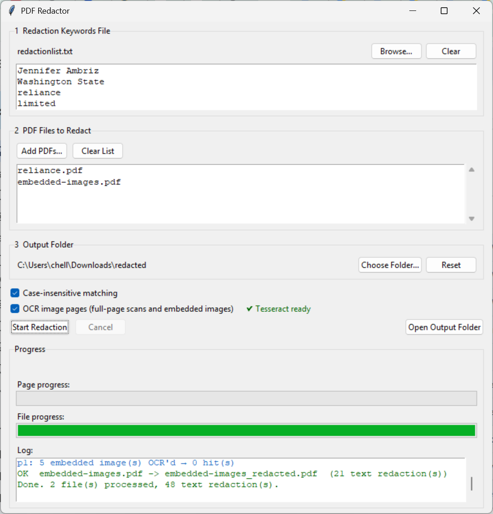

# PDFRedactor

A self-contained Windows desktop application that redacts sensitive keywords from PDF files — including text, scanned pages, and images embedded within pages — using keyword matching and Tesseract OCR.

## Screenshot



## Features

- **Keyword-based redaction** — load a plain-text keyword list (one per line or comma-separated) and redact every match across all pages
- **Case-insensitive matching** — optional toggle to catch all capitalisation variants
- **OCR redaction** — automatically detects image-only pages (scans) and embedded images within mixed-content pages, runs Tesseract OCR, and redacts matching words directly in the image pixels
- **Multi-file batch processing** — queue multiple PDFs and process them in one run
- **Progress tracking** — per-page and per-file progress bars with a live log showing redaction counts and OCR activity
- **Custom output folder** — save redacted files alongside the originals or to a chosen directory
- **No internet required** — fully offline after installation

## Installation (Windows 10/11)

1. Download **PDFRedactOCR_Setup.exe** from the [Releases](../../releases) page
2. Double-click to install — no administrator rights required
3. A **PDF Redactor** shortcut is added to your Desktop and Start Menu
4. Click the shortcut to launch

The installer bundles Python 3.11, PyMuPDF, pytesseract, Pillow, and Tesseract OCR with English language data. Nothing else needs to be installed.

## Usage

1. **Keywords file** — click **Browse…** to load a `.txt` file containing the terms to redact.
   Each term on its own line, or multiple terms comma-separated:
   ```
   John Smith
   john.smith@example.com
   555-1234
   ```
2. **PDF files** — click **Add PDFs…** to queue one or more PDF files
3. **Output folder** *(optional)* — by default redacted files are saved next to the originals with a `_redacted` suffix. Click **Choose Folder…** to save them elsewhere
4. **Options**
   - *Case-insensitive matching* — also matches `JOHN SMITH`, `john smith`, etc.
   - *OCR image pages* — enables OCR for scanned pages and images embedded in text pages (enabled by default; requires the bundled Tesseract)
5. Click **Start Redaction**

Redacted PDFs are saved as `<original_name>_redacted.pdf`. The log panel shows how many text and OCR redactions were applied per file.

## Building the installer (macOS)

Requirements: macOS with Homebrew

```bash
brew install nsis
python3 build_windows_installer.py
```

The script downloads all dependencies automatically (Python runtime, wheels, Tesseract) and compiles `dist_windows/PDFRedactOCR_Setup.exe`. `sevenzip` is installed via Homebrew automatically if not already present.

## Keyword file format

```
# Lines starting with # are comments
First Last
email@domain.com
Account Number, SSN, Date of Birth
123-45-6789
```

## Dependencies (bundled — no separate install needed)

| Component | Version |
|---|---|
| Python | 3.11 |
| PyMuPDF | 1.27+ |
| pytesseract | 0.3.13 |
| Pillow | 12+ |
| Tesseract OCR | 5.4 (English) |

## License

MIT
